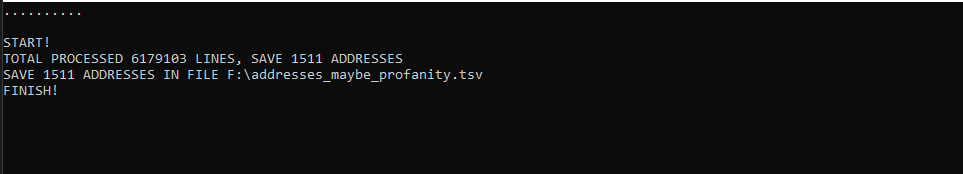

# Фильтр "красивых" адресов Profanity

## Файл config.json
* ***"path_file_in": "F:\\addresses_etherium.tsv"*** - "путь + имя" обрабатываемого файла. Если оставить пустым "", то путь будет запрашиваться в программе. 
* ***"path_file_out": "F:\\addresses_maybe_profanity.tsv"*** - "путь + имя" куда будут сохранены результаты фильтрации. Если оставить пустым "", то путь будет запрашиваться в программе.
* ***"score_double": 0*** - указываем количество идущих подряд "двойных" чисел (00, 11, 22, ... EE, FF). Если указать 0, то фильтрация по "двойным" числам производиться не будет.
* ***"pattern": [ 
		"DED", 
		"ABCDEF", 
		"222222" 
		]*** - через запятую вставляем строки которые будут искаться в адресах. Последнюю строку оставляем без запятой.

## Описание
Программа фильтрует и сохраняет в текстовый файл "красивые" адреса Etherium, которые могут быть созданы алгоритмом Profanity. Параметры фильтрации настраиваются в файле config.json. Программа задействует все свободные ядра процессора.

## Файл FilterAddressesProfanity.exe находится в папке exe

### ОБСУЖДЕНИЕ КОДА: https://t.me/brute_force_gpu
